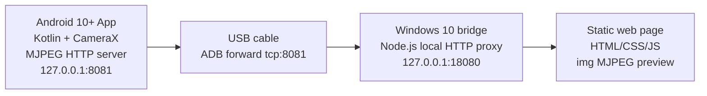

# USB Android Camera MVP Implementation

## 1. Feasibility

Pure static HTML cannot directly call an Android phone camera through USB. Browsers can only access camera devices exposed to the operating system as local media devices, and a USB-connected Android phone is not automatically exposed as a browser camera.

This MVP is feasible by adding a local bridge:

- Android App captures the phone camera with CameraX.
- Android App serves MJPEG over an HTTP endpoint bound to phone `127.0.0.1:8081`.
- Windows 10 uses ADB USB forwarding: `adb forward tcp:8081 tcp:8081`.
- A Windows local Node.js bridge proxies that stream to `http://127.0.0.1:18080/camera`.
- Static HTML displays it with ``.

No remote server and no Windows virtual camera driver are required for the MVP.

## 2. Architecture



## 3. Directory Structure

```text
usb-android-camera-mvp/
  README.md
  IMPLEMENTATION.md
  android/
    settings.gradle
    build.gradle
    app/
      build.gradle
      src/main/AndroidManifest.xml
      src/main/java/com/wk1995/usbandroidcamera/
        MainActivity.kt
        MjpegServer.kt
        ImageConverters.kt
      src/main/res/layout/activity_main.xml
      src/main/res/values/strings.xml
      src/main/res/values/styles.xml
  bridge/
    package.json
    bridge.js
  web/
    index.html
    style.css
    app.js
```

## 4. Android App Key Code

Full code:

- `android/app/src/main/java/com/wk1995/usbandroidcamera/MainActivity.kt`
- `android/app/src/main/java/com/wk1995/usbandroidcamera/MjpegServer.kt`
- `android/app/src/main/java/com/wk1995/usbandroidcamera/ImageConverters.kt`

The app uses CameraX `Preview` for local phone preview and `ImageAnalysis` for frames. Frames are converted from `YUV_420_888` to JPEG and published as MJPEG multipart responses.

Important values:

```kotlin
private val targetFps = 12
private val jpegQuality = 70
private var lensFacing = CameraSelector.LENS_FACING_BACK
```

Android HTTP endpoints:

```text
GET  /stream    multipart/x-mixed-replace MJPEG
GET  /snapshot  latest JPEG frame
GET  /health    JSON health state
POST /switch    switch front/back camera
```

## 5. Windows Local Bridge Code

Full code:

- `bridge/bridge.js`

The bridge:

- Detects Windows 10.
- Finds `adb`.
- Checks for one authorized Android device.
- Checks Android SDK >= 29.
- Runs `adb forward tcp:8081 tcp:8081`.
- Provides `/launch-app`, which runs `adb shell am start -n com.wk1995.usbandroidcamera/.MainActivity --ez autoStart true`.
- Proxies Android `/stream` to browser `/camera`.
- Adds CORS headers.
- Serves the static web client from `web/`.

Run:

```powershell
cd usb-android-camera-mvp\bridge
node bridge.js
```

Optional ports:

```powershell
node bridge.js --web-port=18081 --android-port=8081
```

The bridge requires Windows 10 and a USB-looking ADB device by default. For development on another system, use:

```powershell
node bridge.js --force
```

## 6. Static Web Code

Full code:

- `web/index.html`
- `web/style.css`
- `web/app.js`

The stream display path is intentionally simple:

```html

```

`web/app.js` sets:

```js
stream.src = "http://127.0.0.1:18080/camera?t=" + Date.now();
```

Controls:

- Launch Android App and start streaming
- Start
- Stop
- Switch front/back camera
- Snapshot

## 7. Windows 10 Installation And Run

1. Install Node.js 18+.
2. Install Android Platform Tools.
3. Ensure `adb.exe` is in `PATH`:

```powershell
adb version
```

4. Connect Android phone with a USB data cable.
5. Confirm device:

```powershell
adb devices
```

6. Build and install the Android app from Android Studio.
7. Open the Android app and tap **Start stream**.
8. Start bridge:

```powershell
cd usb-android-camera-mvp\bridge
node bridge.js
```

9. Open:

```text
http://127.0.0.1:18080/
```

10. Click **打开手机 App 并推流** to launch the Android app from the web page through the local bridge. This requires USB debugging authorization and the Android app already installed.

## 8. Android Installation And Run

1. Use Android 10+.
2. Enable Developer options.
3. Enable USB debugging.
4. Connect to Windows by USB.
5. Accept USB debugging authorization.
6. Open `usb-android-camera-mvp/android` in Android Studio.
7. Run the app on the phone.
8. Grant camera permission.
9. Tap **Start stream**.

## 9. Troubleshooting

### ADB cannot find device

```powershell
adb kill-server
adb start-server
adb devices
```

If state is `unauthorized`, unlock the phone and accept the USB debugging prompt. Replace the cable if it is charge-only.

### Port occupied

Default bridge ports:

```text
Android forwarded port: 8081
Web bridge port: 18080
```

Remove old forward:

```powershell
adb forward --remove tcp:8081
```

Change web port:

```powershell
node bridge.js --web-port=18081
```

### CORS

The bridge adds permissive CORS headers. If opening `web/index.html` by double-click behaves differently across browsers, open the bridge-served page:

```text
http://127.0.0.1:18080/
```

### Black screen

Check in order:

1. Android app preview is visible.
2. Android camera permission is granted.
3. Android app stream is started.
4. Windows bridge shows `ADB forward`.
5. `http://127.0.0.1:18080/android-health` returns JSON.
6. `adb forward --list` includes `tcp:8081`.
7. If the web launch button fails, run `adb shell am start -n com.wk1995.usbandroidcamera/.MainActivity --ez autoStart true` manually and check the output.

### High latency

MJPEG is bandwidth-heavy. Reduce `targetFps`, JPEG quality, or CameraX resolution strategy in `MainActivity.kt`.

## 10. Upgrade Directions

- H.264/WebRTC to reduce latency and bandwidth.
- OBS Virtual Camera output.
- Windows DirectShow or Media Foundation virtual camera driver.
- Multi-resolution and frame-rate UI.
- More robust front/back camera switching and device capability detection.
- Microphone capture with audio/video sync.
