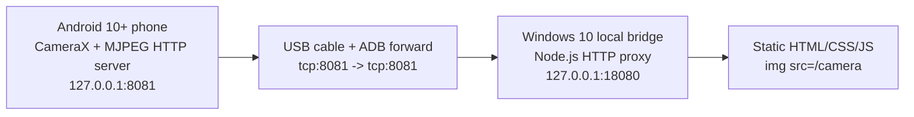

# USB Android Camera MVP

This MVP streams an Android 10+ phone camera to a static web page over USB.

Pure static HTML cannot open an Android phone camera over USB. The working path is:

1. Android app captures the back camera with CameraX.
2. Android app serves MJPEG on `127.0.0.1:8081` inside the phone.
3. Windows bridge runs `adb forward tcp:8081 tcp:8081`.
4. Windows bridge exposes `http://127.0.0.1:18080/camera`.
5. Static web page displays the MJPEG stream with ``.

## Architecture



## Directory

```text
usb-android-camera-mvp/
  android/                 Android Studio project
  bridge/                  Windows local Node.js bridge
  web/                     Static web client
```

## Windows 10 Run

1. Install Node.js 18+.
2. Install Android Platform Tools and make `adb.exe` available in `PATH`.
3. Connect the Android phone by USB.
4. Enable Developer options and USB debugging on the phone.
5. Accept the USB debugging prompt.
6. Build and install the Android app from `android/`.
7. Open the app and tap **Start stream**.
8. Run:

```powershell
cd usb-android-camera-mvp\bridge
node bridge.js
```

The bridge requires Windows 10 and a USB-looking ADB device by default. For development on another system, run `node bridge.js --force`.

9. Open:

```text
http://127.0.0.1:18080/
```

The bridge also works with the static file opened directly, because the page calls `http://127.0.0.1:18080`.
Click **打开手机 App 并推流** in the page to ask the bridge to run `adb shell am start` and launch the Android app with `autoStart=true`.

## Android Run

1. Open `usb-android-camera-mvp/android` in Android Studio.
2. Let Gradle sync.
3. Select the connected Android 10+ phone.
4. Run the app.
5. Grant camera permission.
6. Tap **Start stream**.

## Troubleshooting

### ADB cannot find the device

Run:

```powershell
adb kill-server
adb start-server
adb devices
```

If the device is `unauthorized`, unlock the phone and accept the USB debugging prompt. Use a data cable, not a charge-only cable.

### Port is occupied

The defaults are:

- Android forwarded port: `8081`
- Web bridge port: `18080`

Run a different web port:

```powershell
node bridge.js --web-port 18081
```

If `8081` is occupied:

```powershell
adb forward --remove tcp:8081
```

### Web CORS

The bridge adds:

```text
Access-Control-Allow-Origin: *
```

Use `http://127.0.0.1:18080/` if a browser blocks direct file access behavior.

### Black screen

- Confirm the Android app shows preview.
- Confirm camera permission was granted.
- Tap **Start stream** in the Android app.
- Open `http://127.0.0.1:18080/health` on Windows.
- Check `adb forward --list`.
- If launching from the web page fails, confirm the app package is installed: `adb shell pm list packages | findstr usbandroidcamera`.

### High latency

MJPEG is simple but bandwidth-heavy. Lower resolution, JPEG quality, or FPS in `MainActivity.kt`:

```kotlin
private val targetWidth = 1280
private val targetHeight = 720
private val targetFps = 12
private val jpegQuality = 70
```

## Future Upgrades

- H.264 over WebRTC for lower latency.
- OBS Virtual Camera output.
- Windows DirectShow or Media Foundation virtual camera.
- User-selectable resolution and frame rate.
- Better front/back camera switching.
- Microphone capture and audio/video sync.
